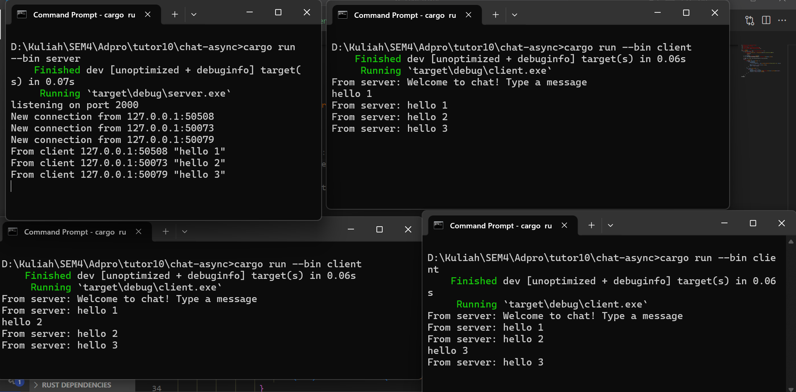
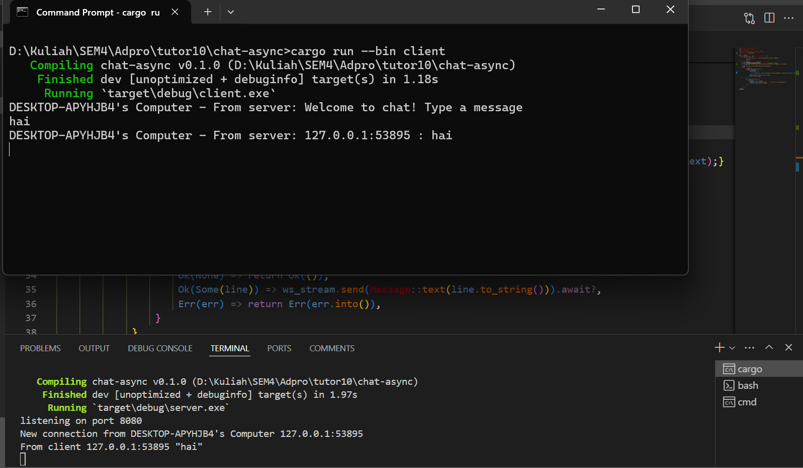

# Module 10 tutorial broadcast

1. Experiment 2.1: Original code, and how it run

 Firstly, i run the server and then 3 of clients. In the server side, i can see how many of clients that connect to the server and ready to send a message each other and recorded to the server, and when i type "hello" in client 1 the message will be sent to server and all clients that connect to the server will receive the message.

2. Experiment 2.2: Modifying port
For port modifying, i change the port number in server and client because it should be in the same port number to connect each other. TCP are utilized by the server side, on the other hand websocket is used by the client side, as we can see there is a syntax that says the server using TCP `let listener = TcpListener::bind("127.0.0.1:8080").await?;` and the client using websocket `ClientBuilder::from_uri(Uri::from_static("ws://127.0.0.1:8080"))` from tokio.

3. Experiment 2.3: Small changes, add IP and Port
    
I am utilizin `ghostname` library to show the hostname for the client and server, on the both side i made a changes to send a message consist of the hostname and the message and wrap it into a string. The server will receive the message and split it into 2 parts, the hostname and the message, and then the server will send the message to all clients that connect to the server.